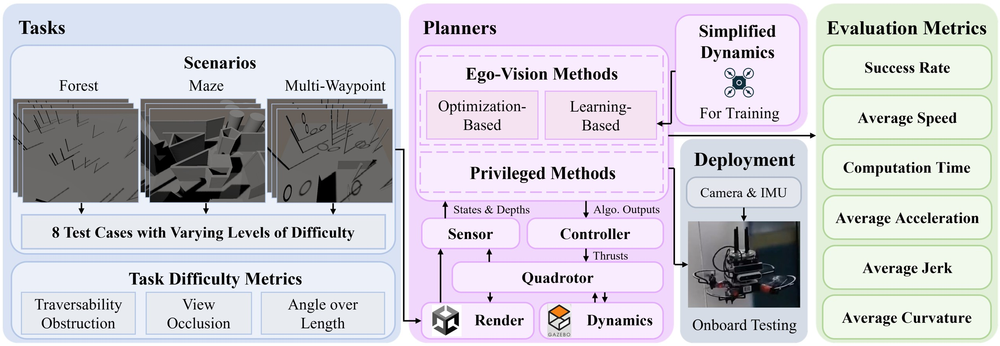
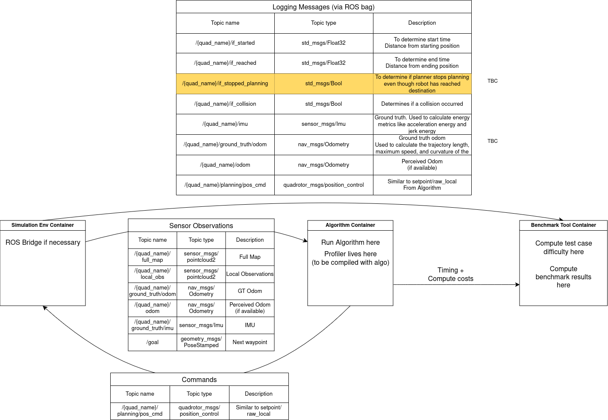

# Flightbench
Quadrotor trajectory benchmark tool adapted from https://github.com/thu-uav/FlightBench

## About
This repo contains a framework used for benchmarking local planners, measuring their performance. This framework is meant to be modular such that the 2 main containers (Simulator & Algorithm) are hotswappable as long as the interfaces adhere to the standards.<br>


<p align="center">High level architecture</p>

<details>
    <summary>Interfaces</summary>


<p align="center"> Interfaces diagram</p>

</details>

## Setup
Before running framework, there are some setup that needs to be done.
1. Ensure that the inputs / outputs of the simulator matches
1. Bridge the algorithms if necessary (default simulator [MARSIM](https://github.com/DinoHub/marsim/tree/development) is in ROS1)

#### Simulator specific setup
1. Ensure that the file structure of the simulator code is as follows:<br>
```
Simulator
│   README.md  
│
└─── docker
│   │   Dockerfile
│   │   launch_sim.sh
│   │   ...
│   
└─── src
|   │   file021.txt
|   │   file022.txt
|   |   ...
|
...
```
2. ```launch_sim.sh``` is a standard file that interfaces with the benchmark tool. It can be found in ```/example_scripts```. Update the demarcated region with simulator specific codes. An example is showed below. 
```
#### Simulation Specific Portions Start ####
# Launch simulator
roslaunch test_interface single_drone_test.launch init_x:=$init_x init_y:=$init_y init_z:=$init_z init_yaw:=$init_yaw map:=$map &

#### Simulation Specific Portions End  ####
```

#### Algorithm specific setup
1. Ensure that the file structure of the simulator code is as follows:<br>
```
Algorithm
│   README.md  
│
└─── docker
│   │   Dockerfile
│   │   ...
│   
└─── src
|   │   launch_algo.sh
|   |   ...
|
...
```
2. ```launch_algo.sh``` is a standard file that interfaces with the benchmark tool. It can be found in ```/example_scripts```. Update the demarcated region with simulator specific codes. An example is showed below.
```
#### Algorithm Specific Portions Start ####

# Launch the algorithm
roslaunch plan_manage kino_replan_marsim.launch &

# Wait for algorithm to be ready
# Update to something algorithm specific
sleep 3
#### Algorithm Specific Portions End  ####
```

Note: ```sleep 3``` is used to above as a proxy delay function to prevent race conditions. It should be set to something algorithm specific. A signal (rostopic) will be published after this delay to inform Simulation side that algorithm is ready.

### Benchmark specific setup
1. Update `/docker/.env` with the respective file paths to the simulator and algorithm respectively. Note that the path should point to the `/docker` folder for both the simulator and algorithm.

## Usage

### Data Collection
To collect relevant data, run ```./run_data_collection.sh <algorithm_name> <test_case>```. <br>
```<algorithm_name>``` is of type `string` and used only in the naming of the collected rosbags.<br>
```<test_case>``` is of type `int` and used to determine the test case.

`./run_data_collection.sh` will call a docker compose file that starts up 3 containers (1. roscore, 2. algorithm, 3. simulation in above order). The start up scripts in the container will launch the respective simulation / algorithm.

Currently, data collection is manual i.e. the user needs to press `ctrl-c`to kill `./run_data_collection.sh` for the rosbag to be saved. It will be automated in future releases.

The recorded rosbag will be saved in `src/scripts/rosbags`.

<details>
<summary>Example run</summary>

An example with of the benchmark tool availble with [MARSIM](https://github.com/DinoHub/marsim/tree/development) as the simulator and [Fast Planner](https://github.com/DinoHub/marsim/tree/development) as the algorithm.

1. Clone the respective repositories.
```
git clone -b development git@github.com:DinoHub/fast_planner.git
git clone -b development git@github.com:DinoHub/marsim.git
```

2. Update `/docker/.env` file with the correct folder paths
3. Run the following command
```
./run_data_collection.sh fastplanner <test_case>
```

</details>

### Data processing
To process the collected data, run `python3 bag_parser.py <path_to_rosbag> <test_case_id> <algorithm_name>`. A docker container to run this file is also available by running `./run_docker.sh` in `/docker` folder.

<details>
<summary>Example output</summary>
An example output is shown below


<p align="center"> Example Output</p>

In the example output, 3 rosbags were collected. Data from failed runs (e.g. In the first rosbag, the drone collided with the environment). Only successful runs i.e. drones that reach the final waypoint without collision will be considered.
</details>

## Environments
We provide 3 distinct scenarios: forest, maze, and multi-waypoint.


They can be downloaded from [here](https://drive.google.com/file/d/1msXzq1MTkHgAzV1GZ1rRBSLH5geebK-Y/view?usp=drive_link). The assets are in ply format. Do convert them to the format required by the simulator.

## Compute Difficulty
The difficulty of the each test case can be measured using the following metrics (Traversability Obstruction, View Occlusion and Angle Over Length). More details can be found in the [paper](https://arxiv.org/abs/2406.05687).

The task difficulty metrics defines on test cases. Each test case consists of a scenario, a start & end point, and a guiding path. The scenario, start point, and end point are self defined. We use path searching method from [sb_min_time](https://github.com/uzh-rpg/sb_min_time_quadrotor_planning) to generate guiding path. A [private copy](/ref_path_finder/src/README.md) is cloned along with this repository. Follow the instructions there to set things up.

According to the instructions, the topological guiding path will be generated at first step. Then move them into the origanized scene folder.

We provide 8 test cases for evaluation.

| test_case_num |     name    |  TO  |  VO  |   AOL  |
|:-------------:|:-----------:|:----:|:----:|:------:|
| 0             |  forest-low | 0.76 | 0.30 | 7.6e-4 |
| 1             |  forest-mid | 0.92 | 0.44 | 1.6e-3 |
| 2             | forest-high |  0.9 |  0.6 | 5.7e-3 |
| 3             |   maze-low  | 1.42 | 0.51 | 1.4e-3 |
| 4             |   maze-mid  | 1.51 | 1.01 |  0.01  |
| 5             |  maze-high  | 1.54 | 1.39 |  0.61  |
| 6             |  racing-low | 1.81 | 0.55 |  0.08  |
| 7             |  racing-mid | 1.58 | 1.13 |  0.94  |