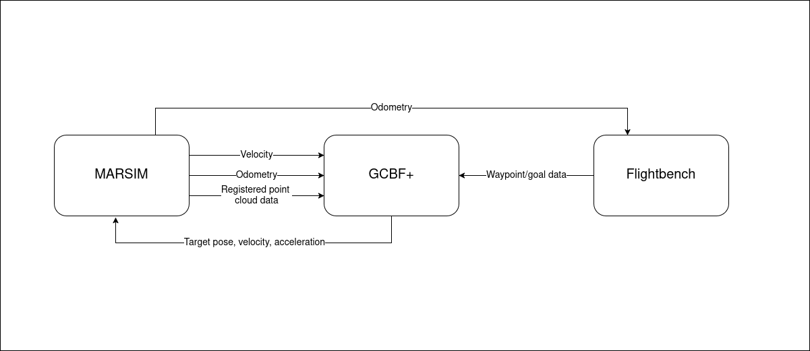

# GCBF+ for ROS
ROS implementation of the GCBF+ algorithm, from https://github.com/MIT-REALM/gcbfplus

## About
This repo contains an adaptation of the GCBF+ algorithm, for application to real-world vehicles, built on ROS Noetic. This implementation comes packaged with a version of Flightbench and MARSIM for testing purposes. \
Sample videos can be found [here](https://youtube.com/playlist?list=PL12zLXi4Ok1X7GVKHpEpGT2uaTv1C64nN&si=iJ7RtSvj2UF87I7p). \
\

<p align="center">System architecture diagram</p>

## Setup
Verify that NVIDIA CUDA is installed on your machine. 

Clone this repository on your machine.
Then, proceed to install dependencies for GCBF+.
```
cd gcbfplus_ros/gcbfplus_ros/docker
./run_docker.sh
source install.sh
exit
```
Update `/Flightbench/docker/.env` with the respective file paths to the simulator and algorithm respectively. Note that the path should point to the `/docker` folder for both the simulator and algorithm.


## Usage
To start running, run 
``` 
cd gcbfplus_ros/Flightbench/docker
./run_data_collection.sh <planner_name> <test_case> <num_agents>
``` 
```<algorithm_name>``` is of type `string` and used only in the naming of the collected rosbags. \
```<test_case>``` is of type `int` and used to determine the test case for the naming of the collected rosbags. \
```<num_agents>``` is of type `int` and used to determine the number of drones to spawn. Currently, spawning up to 8 drones is supported. \
Collection of rosbags is currently disabled, and can be enabled at line 60 of ```/marsim/docker/launch_sim.sh```. Processing of rosbags is better detailed [here](https://github.com/DinoHub/Flightbench/blob/development/README.md#data-processing). \
To end the run, users must manually ```ctrl-c``` to kill all processes. \
\
Currently, it is configured to perform a 4 drone position swap, on the ```racing-mid``` map, as shown in the video.
To change the waypoints of each drone or the map, edit ```/marsim/docker/config.sh```. 

## Known issues
Sometimes the algo-container will get stuck. This can be confirmed when there is no output from the algo-container in the console after the sim-container has begun printing collison check timestamps. In this case, simply kill processes and retry. \
\
If you wish to train the model, please clone the [original repoisitory](https://github.com/MIT-REALM/gcbfplus/), and follow their instructions there. This repository has breaking changes made to the training method, and training does not work here. \
\
This is currently only configured to work in the DoubleIntegrator environment. To test other environments, please replace the output of the ```get_lidar_vmap``` function in the respective ```env.get_graph()``` with the obtained LIDAR data from the simulator, as is done currently in ```/gcbfplus_ros/src/gcbfplus_ros/src/gcbfplus/env/double_integrator.py```.